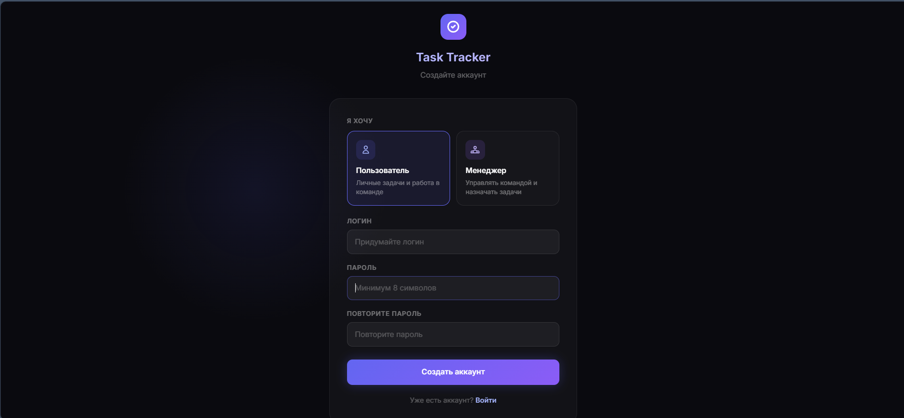
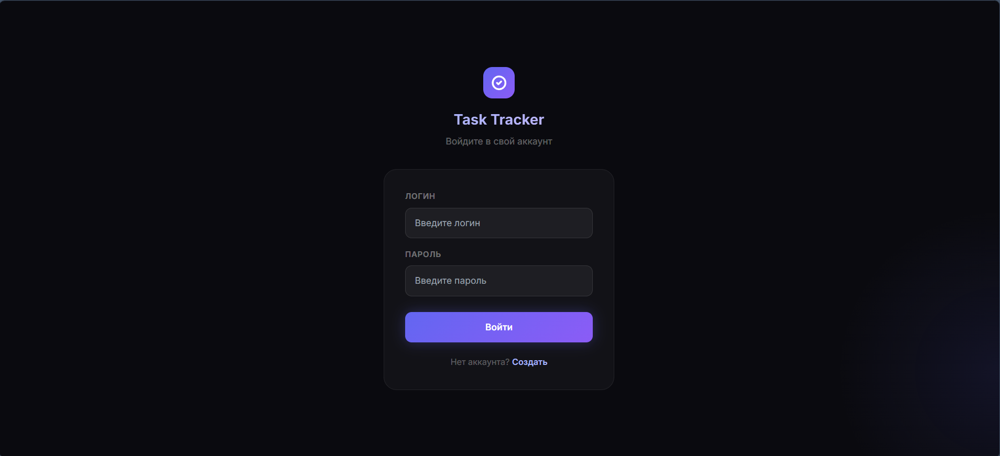
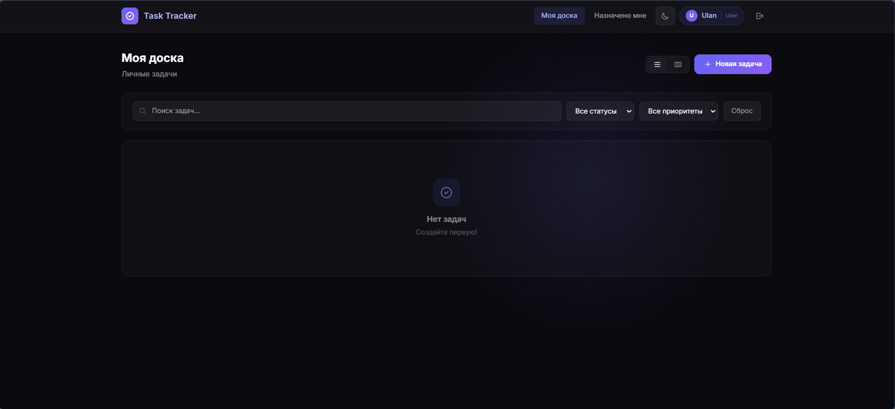
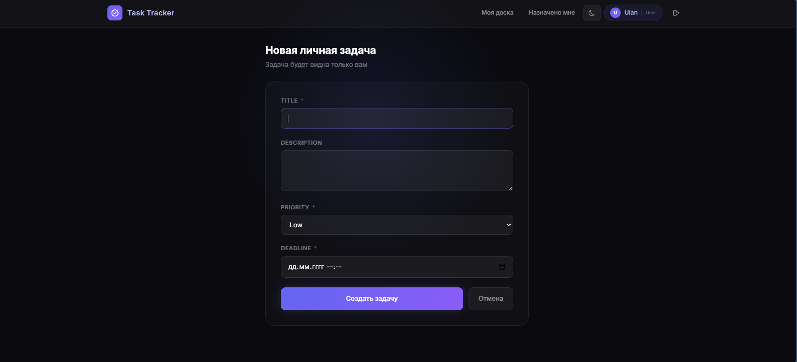
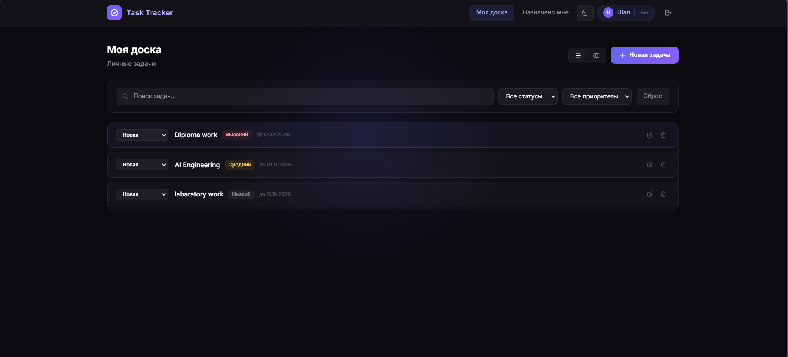
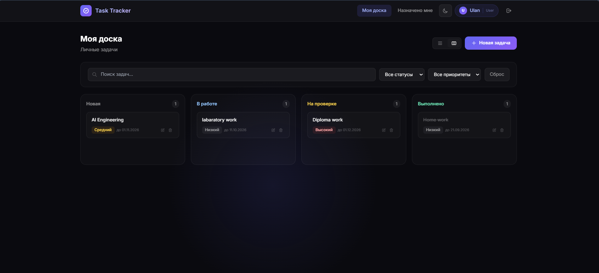
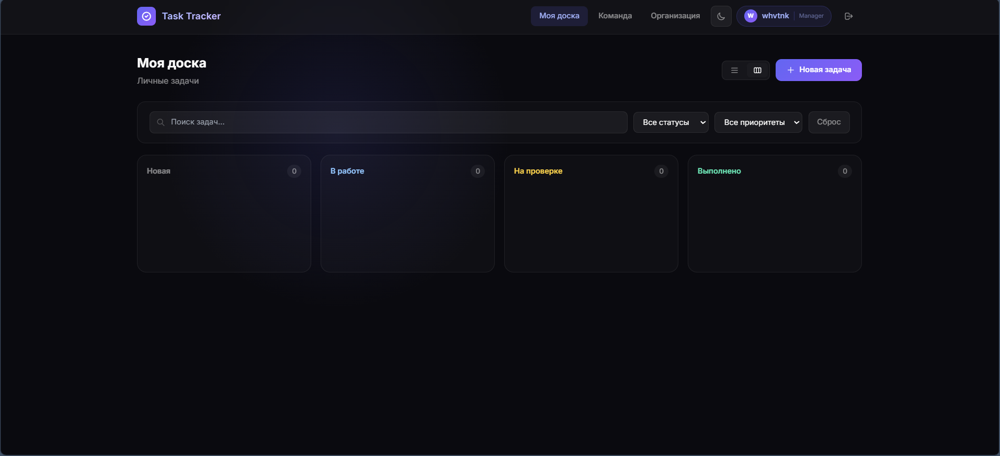
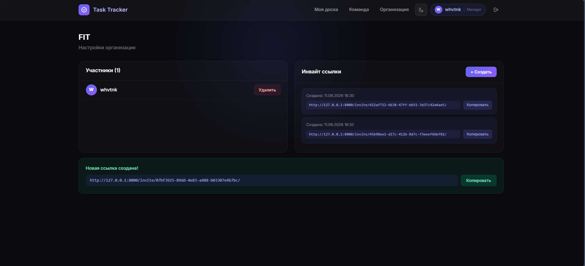
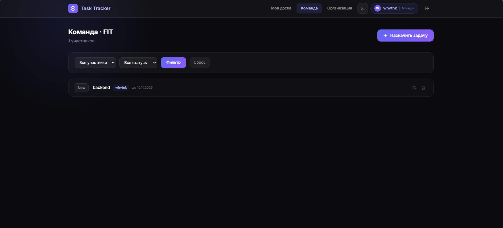
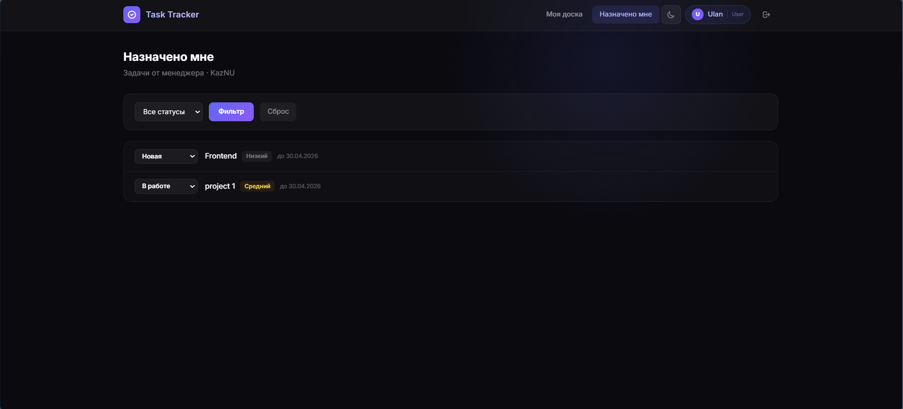

# Task Tracker

A task management web application built with Django, featuring role-based access control, a REST API, and a dark-themed interface.


## Overview

Task Tracker is a Django application for managing personal and team tasks. It supports two user roles — regular users and managers — with managers able to create organizations, invite members, and assign tasks to them. The backend is server-rendered (no JS build step) and exposes a REST API secured with JWT authentication.

## Features

- Personal task board for individual task management
- Organization-based task assignment for teams
- Manager and user roles with separate permissions
- Invite-link system for joining an organization
- Automatic overdue task detection
- REST API with filtering, search, and ordering
- JWT-based authentication
- Analytics dashboard for superusers

## Screenshots

| Sign in | Login |
|---|---|
|  |  |

| After login | Task creation |
|---|---|
|  |  |

| After creating a task | Another view |
|---|---|
|  |  |

| Manager dashboard | Manager links |
|---|---|
|  |  |

| Team management | Assigned tasks |
|---|---|
|  |  |

## Tech Stack

| Layer | Technology |
|---|---|
| Backend | Django, Django REST Framework |
| Database | PostgreSQL |
| Authentication | JWT (djangorestframework-simplejwt) |
| Frontend | Django templates, Tailwind CSS |

## Architecture

The project is a single Django app (`tasks/`) containing all models, views, serializers, forms, and templates.

### Users and roles

Django's built-in `User` model is extended through a one-to-one `UserProfile`, which stores a `role` (`manager` or `user`) and an optional `Organization` reference.

- Managers own an organization and invite users to it through single-use invite links.
- Users belong to a single organization and join through an invite link.

### Tasks

Tasks have two types:

- **Personal** — created by a user for themselves, with no organization or assignee.
- **Assigned** — created by a manager, linked to an organization, and assigned to a member.

Each task moves through a status flow: `new → in_progress → review → completed`, with tasks automatically marked `overdue` by a scheduled management command.

### Views

| URL | View | Access |
|---|---|---|
| `/board/` | `task_board` | Any authenticated user — personal tasks |
| `/assigned/` | `assigned_tasks` | Any authenticated user — tasks assigned to them |
| `/manager/` | `manager_board` | Managers — tasks they created |
| `/analytics/` | `analytics_board` | Superusers |
| `/api/tasks/` | `TaskViewSet` | Authenticated — author, assignee, or superuser |
| `/api/analytics/` | `AnalyticsView` | Superusers |

### Permissions

- `IsAdminOrOwner` — task access limited to the author, assignee, or a superuser.
- `IsManager` — restricts manager-only views and actions.
- `IsSuperUser` — restricts analytics access.

### REST API

The API is built with a DRF `ModelViewSet` at `/api/tasks/`, supporting:

- Filtering by status, priority, author, and assignee
- Search by title and description
- Ordering by creation date, deadline, or priority
- Pagination (3 items per page)

Authentication is handled via JWT:

- `POST /api/token/` — obtain a token pair
- `POST /api/token/refresh/` — refresh an access token

## Getting Started

### Prerequisites

- Python 3.10+
- PostgreSQL

### Installation

```bash
git clone https://github.com/whvtnk/task_tracker.git
cd task_tracker

python -m venv ven
ven\Scripts\activate      # Windows
# source ven/bin/activate  # macOS/Linux

pip install -r requirements.txt
```

### Configuration

Database settings are read in `config/settings.py`. Create a `.env` file in the project root (not committed to version control) with:

```
DB_NAME=tt
DB_USER=postgres
DB_PASSWORD=your_password
DB_HOST=localhost
DB_PORT=5432
```

### Running the project

```bash
python manage.py migrate
python manage.py runserver
```

The application will be available at `http://127.0.0.1:8000/board/`.

### Useful commands

```bash
python manage.py makemigrations      # after model changes
python manage.py createsuperuser     # create an admin/analytics user
python manage.py check_deadlines     # mark overdue tasks (run periodically)
python manage.py test tasks          # run tests
```

## Project Status

Built as a university coursework project. UI and feature set are under active development.

## License

MIT
